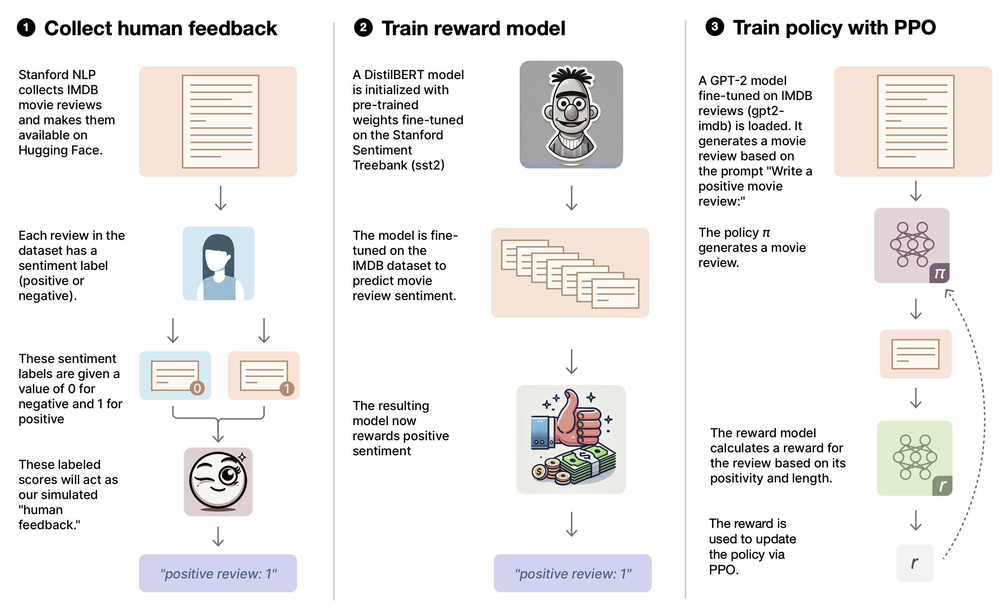

# Simulated RLHF for Positive Movie Review Generation

This project demonstrates a simplified implementation of Reinforcement Learning from Human Feedback (RLHF) to fine-tune a GPT-2 model for generating positive movie reviews. It combines sentiment analysis, language modeling, and reinforcement learning techniques in a single Jupyter notebook, using pre-existing labeled data to simulate human feedback.

## Project Overview

The notebook consists of three main parts:

1. Fine-tuning a sentiment analysis model on pre-labeled data
2. Implementing a RLHF-like process with GPT-2
3. Evaluating and visualizing results

### 1. Fine-tuning Sentiment Analysis Model

We start by fine-tuning a DistilBERT model ([pre-trained](https://huggingface.co/distilbert/distilbert-base-uncased-finetuned-sst-2-english) on [SST-2](https://paperswithcode.com/dataset/sst-2)) on the IMDB dataset for sentiment analysis. This model will serve as our simulated reward function in the RLHF-like process.

### 2. RLHF-like Implementation

Using the fine-tuned sentiment analysis model as a proxy for human feedback, we implement a process similar to RLHF to train GPT-2 to generate more positive movie reviews. This approach uses pre-existing labeled data instead of real-time human feedback, offering a practical demonstration of RLHF concepts within time and resource constraints.

### 3. Evaluation and Visualization

After training, we evaluate the tuned model against the original model and visualize the training metrics to demonstrate the effects of our simulated RLHF process.



## Key Differences from True RLHF

- We use pre-labeled IMDB reviews instead of collecting real-time human feedback.
- Our reward model is trained on general sentiment, not specific to our model's outputs.
- The process is simplified and accelerated for demonstration purposes.

While not a full RLHF implementation, the aim of this project is to provide valuable insights into the principles of aligning language models with specific criteria using reinforcement learning techniques.

## Getting Started

### Running on Google Colab

1. Click here: [](https://colab.research.google.com/github/iankelk/rlhf-imdb/blob/main/RLHF-IMDB.ipynb)

2. Ensure you're using a GPU runtime:
   - Go to Runtime > Change runtime type
   - Select GPU from the dropdown menu

3. Run the cells in order, following the instructions in the notebook.

### Running Locally

If you prefer to run the notebook locally:

1. Clone this repository:
```
git clone https://github.com/iankelk/rlhf-imdb.git
cd rlhf-imdb
```
2. Install required packages:
```
pip install -r requirements.txt
```
3. Open the notebook in Jupyter:
```
jupyter notebook RLHF-IMDB.ipynb
```

## Notebook Structure

The notebook is organized into several sections:

1. Setup and Imports
2. Data Loading and Preprocessing
3. Fine-tuning Sentiment Analysis Model
4. Implementing RLHF
- Reward Function Definition
- PPO Training Setup
- Training Loop
5. Evaluation
- Comparing Original and RLHF-tuned Models
- Visualizing Training Metrics

## Results

After running the notebook, you should see:
- Improved sentiment scores for generated reviews
- Training metric plots showing the evolution of rewards, KL divergence, and losses
- Sample outputs from both the original and RLHF-tuned models

## Contributing

Contributions to improve the project are welcome. Please follow these steps:

1. Fork the repository
2. Create a new branch (`git checkout -b feature/AmazingFeature`)
3. Commit your changes (`git commit -m 'Add some AmazingFeature'`)
4. Push to the branch (`git push origin feature/AmazingFeature`)
5. Open a Pull Request

## License

Copyright © Ian Kelk, 2024. Distributed under the MIT License. See `LICENSE` for more information.

## Acknowledgments

- Hugging Face for their Transformers library
- OpenAI for their work on RLHF
- IMDB for the movie review dataset
- Google Colab for providing GPU resources